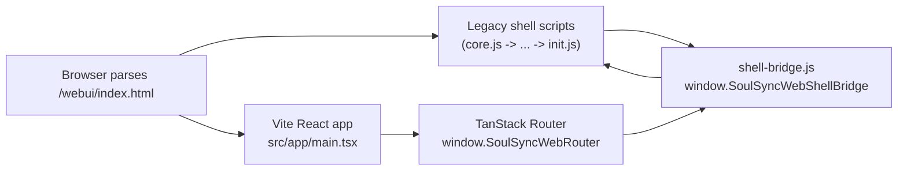

# WebUI Hybrid Rendering

SoulSync's web UI is in a transition phase:

- most pages still render through the legacy vanilla JS shell
- `/issues` is rendered by the new React app
- a small shell bridge keeps both runtimes aware of the active page, profile context, and navigation state

## How It Fits Together



## Runtime Roles

- `webui/static/init.js`
  - boots the legacy shell
  - selects the active profile
  - handles the old page activation flow

- `webui/static/shell-bridge.js`
  - owns the browser-side bridge object
  - exposes `window.SoulSyncWebShellBridge`
  - syncs page chrome between legacy and React

- `webui/src/app/main.tsx`
  - mounts the React app
  - binds `window.SoulSyncWebRouter`

- `webui/src/platform/shell/route-controllers.tsx`
  - listens for bridge readiness
  - keeps React pages aligned with the shell

## Load Order

The current order in `index.html` matters:

1. legacy shell scripts load first
2. `init.js` sets up the shell runtime
3. `shell-bridge.js` publishes the shell bridge after those helpers exist
4. the Vite React app is injected through `{{ vite_assets('body') }}` and boots as a module after parsing

That order avoids load-time references to missing globals and keeps the React side able to react to bridge readiness events. The React entry can start fetching early, but the shell bridge and legacy globals are already available by the time the React runtime starts acting on them.

## Notes

- The bridge is intentionally small and browser-only.
- This is the start of the migration, not a full replacement of the legacy shell.
- When adding another React page, check whether it needs:
  - a route entry in `webui/src/platform/shell/route-manifest.ts`
  - bridge typings in `webui/src/platform/shell/globals.d.ts`
  - a legacy fallback path in `webui/static/init.js`
  - bridge glue or handoff logic in `webui/static/shell-bridge.js`

## Folder Layout

The React webui uses a small set of predictable folders so route slices stay easy to extend,
test, and understand.

```text
webui/src/
  app/         React bootstrap, router, query client, shared API client
  components/  Shared UI primitives
  platform/    Shell bridge and browser/platform integration
  routes/      Route-local code and TanStack Router pages
  test/        Shared test utilities and setup helpers
```

### Route Slices

- Keep route-specific code inside `webui/src/routes/<route>/`.
- Put the routing entry in `route.tsx`.
- Put route-local UI in a `-ui/` folder.
- Prefix non-routing files with `-` so TanStack Router ignores them.
- Keep the route slice small and cohesive.
- Prefer a few files with clear responsibilities over many tiny files with overlapping names.

Example:

```text
webui/src/routes/issues/
  route.tsx
  -issues.types.ts
  -issues.api.ts
  -issues.helpers.ts
  -issues.api.test.ts
  -issues.helpers.test.ts
  -ui/
    issues-page.tsx
    issue-detail-modal.tsx
    issue-domain-host.tsx
```

The initial `issues` slice is the model to follow:

- `-issues.api.ts` holds request code and query options
- `-issues.helpers.ts` holds pure normalization and formatting
- `-issues.types.ts` holds shared types
- `-ui/` holds the page, modal, and legacy handoff UI

### Shared Code

- Put reusable UI in `webui/src/components/`.
- Put shell integration in `webui/src/platform/`.
- Put bootstrap and app-wide wiring in `webui/src/app/`.
- Move code up a level only when it is genuinely shared.
- Avoid creating new conventions that overlap with existing ones.

### Testing Choices

We have a lot of testing tools available, but we do not need all of them for every feature.

- Use plain unit tests for pure functions and small transforms.
- Use React component or route tests when the behavior lives in the UI or router.
- Use MSW-backed tests when request shape, response handling, or error handling matters.
- Use Playwright when the behavior is best proven end-to-end with the server and browser together.
- Prefer the smallest test setup that still proves the thing that can regress.

## Development

The repo root now owns the full local-dev instructions. Start there for the
portable launcher and backend/frontend setup:

1. [README.md](../README.md) for the end-to-end dev flow
2. `npm run check` and `npm run fix` for React-side linting and formatting
