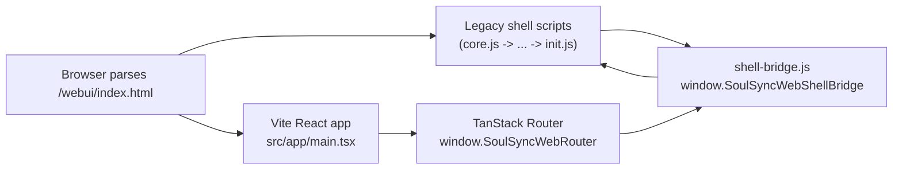

# WebUI Hybrid Rendering

SoulSync's web UI is in a transition phase:

- most pages still render through the legacy vanilla JS shell
- `/issues` is rendered by the new React app
- a small shell bridge keeps both runtimes aware of the active page, profile context, and navigation state

## How It Fits Together

## Runtime Roles

- `webui/static/init.js`
  - boots the legacy shell
  - selects the active profile
  - handles the old page activation flow

- `webui/static/shell-bridge.js`
  - owns the browser-side bridge object
  - exposes `window.SoulSyncWebShellBridge`
  - syncs page chrome between legacy and React

- `webui/src/app/main.tsx`
  - mounts the React app
  - binds `window.SoulSyncWebRouter`

- `webui/src/platform/shell/route-controllers.tsx`
  - listens for bridge readiness
  - keeps React pages aligned with the shell

## Load Order

The current order in `index.html` matters:

1. legacy shell scripts load first
2. `init.js` sets up the shell runtime
3. `shell-bridge.js` publishes the shell bridge after those helpers exist
4. the Vite React app is injected through `{{ vite_assets('body') }}` and boots as a module after parsing

That order avoids load-time references to missing globals and keeps the React side able to react to bridge readiness events. The React entry can start fetching early, but the shell bridge and legacy globals are already available by the time the React runtime starts acting on them.

## Notes

- The bridge is intentionally small and browser-only.
- This is the start of the migration, not a full replacement of the legacy shell.
- When adding another React page, check whether it needs:
  - a route entry in `webui/src/platform/shell/route-manifest.ts`
  - bridge typings in `webui/src/platform/shell/globals.d.ts`
  - a legacy fallback path in `webui/static/init.js`
  - bridge glue or handoff logic in `webui/static/shell-bridge.js`
